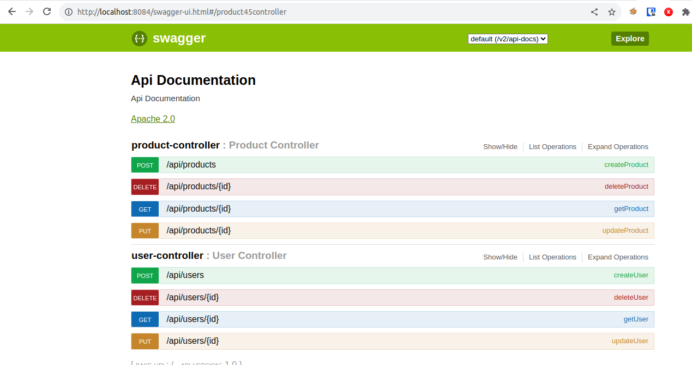

# API-Gateway-Sample

Docker-compose oficial do Kong:
https://github.com/Kong/docker-kong/blob/master/compose/README.md

## Compilação e geração da imagem da API

```bash
cd api-service
mvn package spring-boot:repackage
docker build --build-arg JAR_FILE=target/*.jar -t cpqd/mock/app-api .
```

## Compilação e geração da imagem do FrontEnd

```bash
cd front-end
docker build -t cpqd/mock/app-front .
```

## Docker compose

Baseado no docker-compose.yml oficial do Kong
https://github.com/Kong/docker-kong/blob/master/compose/docker-compose.yml

## Configuração Kong

As entidades Kong podem ser configuradas por meio do arquivo de configuração declarativo config/kong.yaml.


## Start/Stop do Kong + API-Sample (com regras definidas no /config)

```bash
cd docker-kong
docker compose up
docker compose stop
```

## URL API-Sample

http://localhost:8084


## URL Kong
http://localhost:8000


## Kong Gateway

